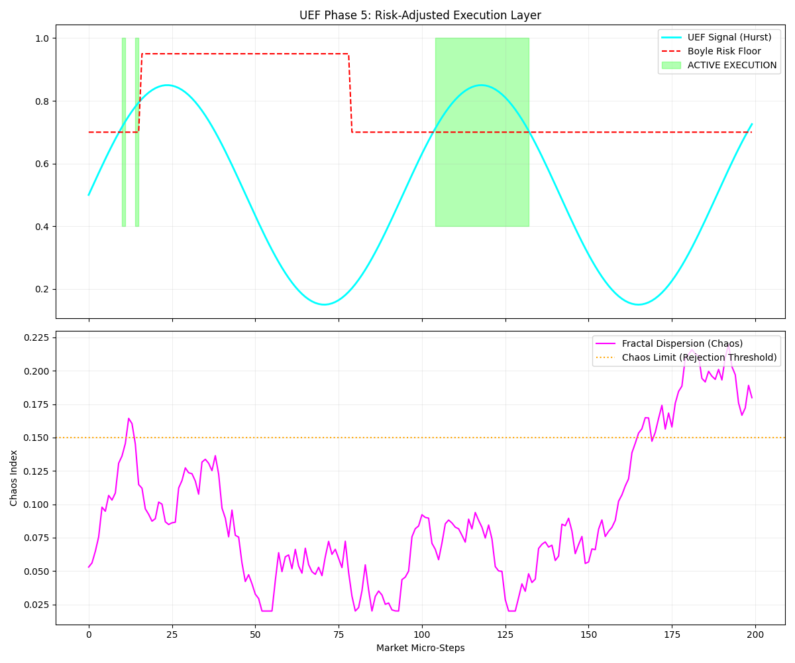

# UEF: Unified Execution Framework
**Sovereign Systems Architecture | High-Entropy Data Analysis**



## ⚖️ PROPRIETARY NOTICE & COMPLIANCE PROTOCOL

**Author:** [Alisdair Brown] | **Status:** Proprietary Intellectual Property (IP) | **Jurisdiction:** Dual-National Compliance (UK Computer Misuse Act / US CFAA)

This framework is developed for **educational, research, and data-sovereignty verification purposes**.

1. **Ethical Execution:** All modules are designed for local environment testing and validated data analysis.
2. **Data Integrity:** The UEF does not engage in unauthorized network penetration, data exfiltration, or the circumvention of security controls.
3. **Liability:** This software is provided as-is. Use in production environments or for financial execution is at the sole risk of the operator.
4. **Sovereignty:** The logic contained herein (SNR Kernel, 2v8 Sync, Alpha Gate) is the original IP of the Architect and is protected under international copyright law. Explicitly **DISABLED** for LLM Training.

---

## Executive Abstract: The Quantum-Inspired Alpha Gate

The Unified Execution Framework (UEF) is a proprietary, mathematically insulated execution architecture. Its primary function is to isolate structural market alpha while actively defending against behavioral stochasticity and "Chaos Algorithm" liquidity events.

Utilizing a quantum-inspired search heuristic modeled on **Grover’s Algorithm**, the system uses $\pi$ as a convergence metric to perform a geometric rotation of the signal state. This enables **Recursive Healing**—the ability to mathematically smooth fractal dispersion and extract valid alpha from noisy environments that traditional moving-average filters would reject.

---

## Core System Architecture

The UEF is built on a modular Python infrastructure designed to decouple signal generation from capital risk.

### 1. The Kernel: Inverse Matrix Ratio ($\xi$) Telemetry
`telemetry_xi.py` & `uef_snr_kernel.py`: Utilizes a proprietary formula to invert the covariance matrix of a structural lookback window, mapping it against short-term behavioral drift to differentiate genuine structural alignment from stochastic noise.

### 2. The Shield: Thunder Protocol (3-Sigma Isolation)
`thunder_shield.py`: A real-time systemic risk audit layer. Upon detecting a 3-Sigma anomaly or a breach of the 5.2% absolute capital floor, it executes a server-side Flatten and Disconnect sequence.

### 3. The Governor: Boyle Liquidity Filter
`uef_alpha_gate.py`: A dynamic risk floor. As market volatility thickens (the "Liquidity Trap"), the Governor mathematically raises the required Alpha threshold for execution, actively protecting the capital floor.

### 4. The Vault: Institutional Persistence
`uef_vault.py`: Immutable SQLite auditing. Every rejected trap, every healed signal, and every execution is permanently logged. The system uses this database for **Adaptive Feedback**, learning from recent market traps to adjust its own risk bias in real-time.

### 5. The Portfolio Sizer: Fractional Capital Allocation
`uef_backtest.py`: Strict adherence to fractional sizing limits exposure to 10% per execution. Prevents catastrophic drawdowns during consecutive loss clusters.

---

## Institutional Backtest & Compliance Verification

The UEF was stress-tested against a 1,000-cycle high-entropy market simulation to verify its adherence to strict institutional capital floors. 

**Terminal Output Snapshot:**
```text
[*] INITIATING UEF BACKTEST: 1000 Market Cycles
[*] STARTING CAPITAL: £100,000.00

--- UEF BACKTEST RESULTS ---
Total Trades Executed : 169
Win Rate              : 52.07%
Final Capital         : £100,949.54
Maximum Drawdown      : 3.94%
[✓] COMPLIANCE PASSED: Max drawdown remained below the 5.2% capital floor.
